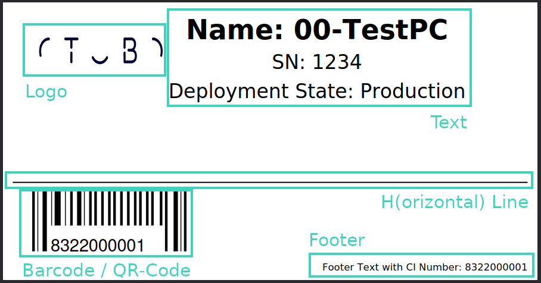

.. toctree::
    :maxdepth: 2
    :caption: Contents

Sacrifice to Sphinx
===================

Description
===========
OTOBO::ITSM config item label print including barcode.

System requirements
===================

Framework
---------
OTOBO 11.0.x

Packages
--------
ITSMConfigurationManagement 11.0.0

Third-party software
--------------------
\-

Usage
=====
The package ITSMConfigItemLabelPrint brings the functionality to create a highly customizable PDF file. This can be done via the added "LabelPrint" button in the Zoom view in the Agent interface.

Setup
-----
To shape the resulting PDF file as needed, a wide variety of options is available. The PDF consists of 5 elements (see Picture) and the respective system configuration:

- Logo (`ITSMConfigItem::Frontend::AgentITSMConfigItemLabelPrint###LogoSetting`)
- Text (`ITSMConfigItem::Frontend::AgentITSMConfigItemLabelPrint###Text`)
- Horizontal Line (`ITSMConfigItem::Frontend::AgentITSMConfigItemLabelPrint###HLineSetting`)
- Barcode (`ITSMConfigItem::Frontend::AgentITSMConfigItemLabelPrint###BarcodeSetting`)
- Footer (`ITSMConfigItem::Frontend::AgentITSMConfigItemLabelPrint###FooterSetting`)

Each of this is only printed if the corresponding system configuration setting is active. This way, it can be defined which elements are wanted and which elements are omitted entirely.

   The screenshot shows the elements available.

Logo
^^^^
For the logo, an image file with the logo is needed. It can be placed in every location in the OTOBO directory. Recommended would be a location like `/opt/otobo/var/https/htdocs/skins/Agent/default/img/LogoFile.png`. The location then must be put into the system configuration setting `Kernel/Modules/AgentITSMConfigItemLabelPrint.pm`, key `LogoPath`. The setting holds some other options which can be used to customize the appearance of the logo in the PDF.

Text
^^^^
The text is printed in a table-like structure, per default from the top middle position downwards. Each entry in the array of the system configuration setting `ITSMConfigItem::Frontend::AgentITSMConfigItemLabelPrint###Text` is printed as a separate line. Within the lines, Template::Toolkit syntax can be used to put in data from the configuration item, e.g. like 'Nr.: [% Data.Number %]', which will produce a result like 'Nr.: 123456789'.

The styling and positioning options of the Text can be customized with the system configuration setting `ITSMConfigItem::Frontend::AgentITSMConfigItemLabelPrint###TableSetting`.

Horizontal Line
^^^^^^^^^^^^^^^
For optical structure, a horizontal line can be placed at a customizable height. In the system configuration setting `ITSMConfigItem::Frontend::AgentITSMConfigItemLabelPrint###HLineSetting`, also the color and line width can be changed.

Barcode
^^^^^^^
The system configuration setting `ITSMConfigItem::Frontend::AgentITSMConfigItemLabelPrint###BarcodeSetting` can be used to change format and appearance of the barcode. The settings have the following meaning:

- BarcodeField: Attribute of the config item used for the barcode.
- Caption: Whether to put the data below the barcode as caption. Ignored for QR code.
- QRCodeLink: When creating a QR code, set the link destination.
- CustomLink: Define a custom link via Template::Toolkit syntax for QR codes.
- Code: Which type of code to print.
- Zone: The base height of the barcode in points.
- LowerMendingZone: If present and applicable, bars for non-printing characters (e.g. start and stop characters) will be extended downward by this many points, and printing characters will be shown below their respective bars. This is enabled by default for EAN-13 barcodes.
- Font: Font to use for the barcode caption.
- FontSize: Font size to use for the barcode caption.

Footer
^^^^^^
In the system configuration setting `ITSMConfigItem::Frontend::AgentITSMConfigItemLabelPrint###FooterSetting`, location, appearance and content of a footer section can be specified. The key 'FooterText' is capable of interpreting Template::Toolkit syntax (compare description of the Text section).

Configuration Reference
-----------------------

Frontend::Agent::ITSMConfigItem::MenuModule
^^^^^^^^^^^^^^^^^^^^^^^^^^^^^^^^^^^^^^^^^^^^^^^^^^^^^^^^^^^^^^^^^^^^^^^^^^^^^^^^^^^^^^^^^^^^^^^^^^^^^^^^^^^^^^^^^^^^^^^^^^^^^^

ITSMConfigItem::Frontend::MenuModule###450-LabelPrint
""""""""""""""""""""""""""""""""""""""""""""""""""""""""""""""""""""""""""""""""""""""""""""""""""""""""""""""""""""""""""""""
Shows a link in the menu to print a label of the configuration item in the zoom view of the agent interface.

Frontend::Agent::ITSMConfigItem::Permission
^^^^^^^^^^^^^^^^^^^^^^^^^^^^^^^^^^^^^^^^^^^^^^^^^^^^^^^^^^^^^^^^^^^^^^^^^^^^^^^^^^^^^^^^^^^^^^^^^^^^^^^^^^^^^^^^^^^^^^^^^^^^^^

ITSMConfigItem::Frontend::AgentITSMConfigItemLabelPrint###Permission
""""""""""""""""""""""""""""""""""""""""""""""""""""""""""""""""""""""""""""""""""""""""""""""""""""""""""""""""""""""""""""""
Required permissions to use the print ITSM configuration item screen in the agent interface.

Frontend::Agent::ModuleRegistration
^^^^^^^^^^^^^^^^^^^^^^^^^^^^^^^^^^^^^^^^^^^^^^^^^^^^^^^^^^^^^^^^^^^^^^^^^^^^^^^^^^^^^^^^^^^^^^^^^^^^^^^^^^^^^^^^^^^^^^^^^^^^^^

Frontend::Module###AgentITSMConfigItemLabelPrint
""""""""""""""""""""""""""""""""""""""""""""""""""""""""""""""""""""""""""""""""""""""""""""""""""""""""""""""""""""""""""""""
Frontend module registration for the agent interface.

Frontend::Agent::ModuleRegistration::MainMenu
^^^^^^^^^^^^^^^^^^^^^^^^^^^^^^^^^^^^^^^^^^^^^^^^^^^^^^^^^^^^^^^^^^^^^^^^^^^^^^^^^^^^^^^^^^^^^^^^^^^^^^^^^^^^^^^^^^^^^^^^^^^^^^

Frontend::Navigation###AgentITSMConfigItemLabelPrint###003-AgentITSMConfigItemLabelPrint
""""""""""""""""""""""""""""""""""""""""""""""""""""""""""""""""""""""""""""""""""""""""""""""""""""""""""""""""""""""""""""""
Main menu item registration.

Frontend::Agent::View::AgentITSMConfigItemLabelPrint
^^^^^^^^^^^^^^^^^^^^^^^^^^^^^^^^^^^^^^^^^^^^^^^^^^^^^^^^^^^^^^^^^^^^^^^^^^^^^^^^^^^^^^^^^^^^^^^^^^^^^^^^^^^^^^^^^^^^^^^^^^^^^^

ITSMConfigItem::Frontend::AgentITSMConfigItemLabelPrint###BarcodeSetting
""""""""""""""""""""""""""""""""""""""""""""""""""""""""""""""""""""""""""""""""""""""""""""""""""""""""""""""""""""""""""""""
Used barcode settings for the label. Options have the following meaning:
- BarcodeField: Attribute of the config item used for the barcode.
- Caption: Whether to put the data below the barcode as caption. Ignored for QR code.
- QRCodeLink: When creating a QR code, set the link destination.
- CustomLink: Define a custom link via Template::Toolkit syntax for QR codes.
- Code: Which type of code to print.
- Zone: The base height of the barcode in points.
- LowerMendingZone: If present and applicable, bars for non-printing characters (e.g. start and stop characters) will be extended downward by this many points, and printing characters will be shown below their respective bars. This is enabled by default for EAN-13 barcodes.
- Font: Font to use for the barcode caption.
- FontSize: Font size to use for the barcode caption.

ITSMConfigItem::Frontend::AgentITSMConfigItemLabelPrint###TableSetting
""""""""""""""""""""""""""""""""""""""""""""""""""""""""""""""""""""""""""""""""""""""""""""""""""""""""""""""""""""""""""""""
Used table settings for the label.

ITSMConfigItem::Frontend::AgentITSMConfigItemLabelPrint###LogoSetting
""""""""""""""""""""""""""""""""""""""""""""""""""""""""""""""""""""""""""""""""""""""""""""""""""""""""""""""""""""""""""""""
Used logo settings for the label. The best size is 142 x 187 px. Please use here px.

ITSMConfigItem::Frontend::AgentITSMConfigItemLabelPrint###HLineSetting
""""""""""""""""""""""""""""""""""""""""""""""""""""""""""""""""""""""""""""""""""""""""""""""""""""""""""""""""""""""""""""""
Used settings for the horizont line.

ITSMConfigItem::Frontend::AgentITSMConfigItemLabelPrint###Text
""""""""""""""""""""""""""""""""""""""""""""""""""""""""""""""""""""""""""""""""""""""""""""""""""""""""""""""""""""""""""""""
Define several lines (one entry per line) to be printed as label content. Template::Toolkit is supported, thus config item data can be used like "Number: [% Data.Number %]".

ITSMConfigItem::Frontend::AgentITSMConfigItemLabelPrint###FooterSetting
""""""""""""""""""""""""""""""""""""""""""""""""""""""""""""""""""""""""""""""""""""""""""""""""""""""""""""""""""""""""""""""
Used footer settings for the label. Template::Toolkit is supported, thus config item data can be used like "Number: [% Data.Number %]".

ITSMConfigItem::Frontend::AgentITSMConfigItemLabelPrint###PageSetting
""""""""""""""""""""""""""""""""""""""""""""""""""""""""""""""""""""""""""""""""""""""""""""""""""""""""""""""""""""""""""""""
Used page size in mm and other page settings. Be carefull if you change the size, it´s possible that the label is unusable.

About
=======

Contact
-------
| Rother OSS GmbH
| Email: hello@otobo.de
| Web: https://otobo.de

Version
-------
Author: |doc-vendor| / Version: |doc-version| / Date of release: |doc-datestamp|
